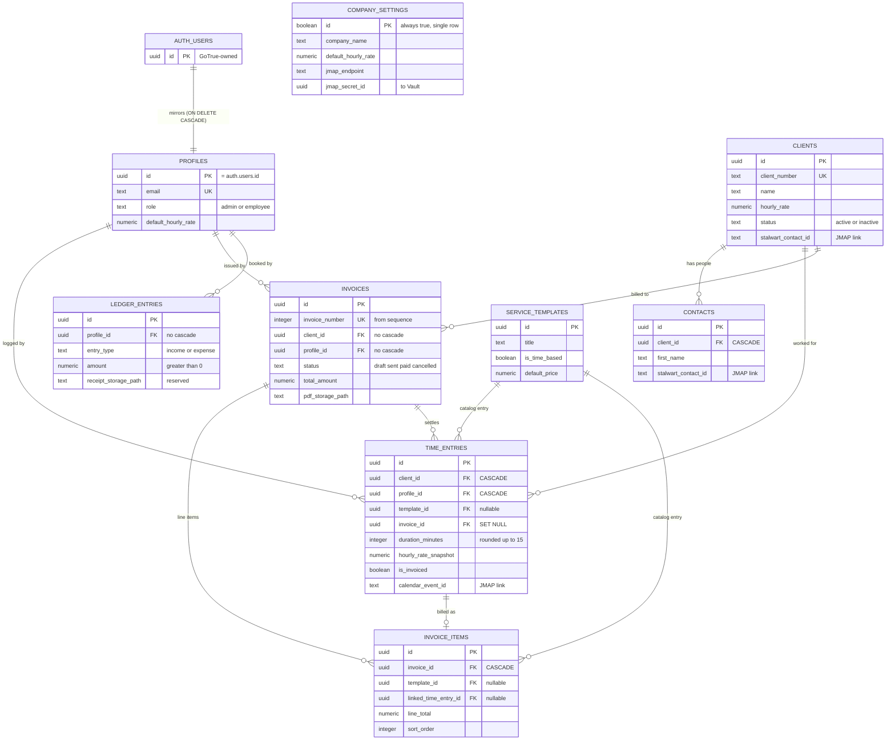
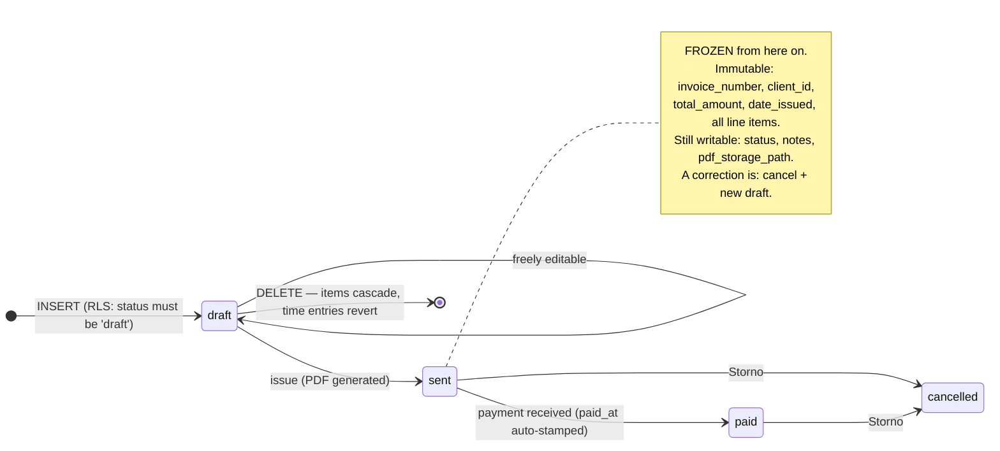
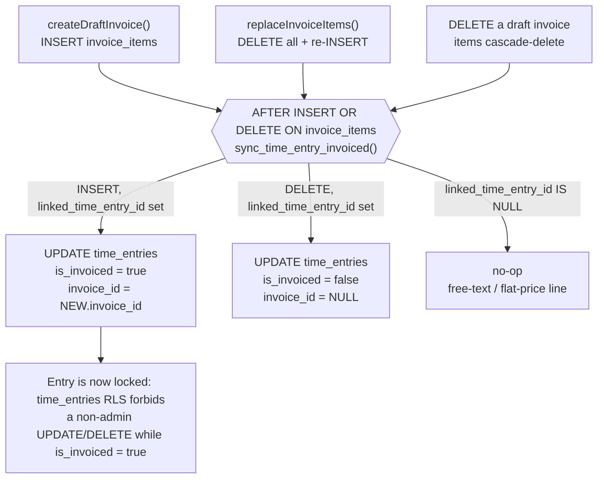
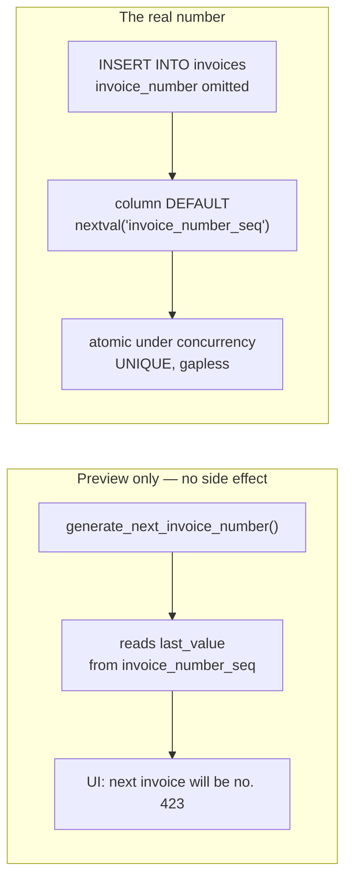
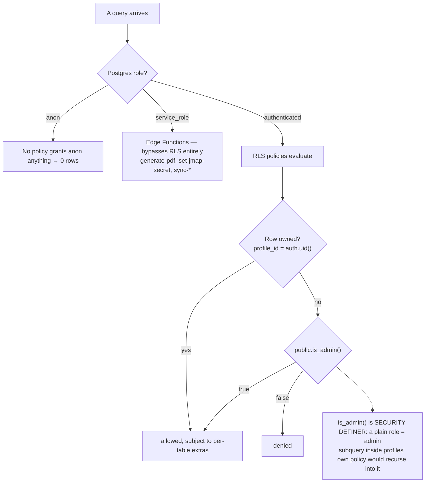
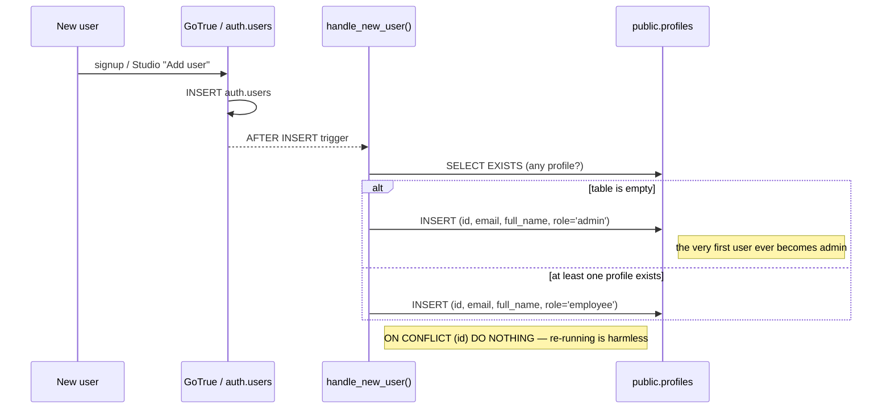

# Database schema

Reference for the ecke-crm Postgres/Supabase database. The **source of truth is the
migration** — [`supabase/migrations/20260101000000_initial_schema.sql`](../supabase/migrations/20260101000000_initial_schema.sql).
This document explains it; when the two disagree, the migration wins and this file is
the bug.

**Shape of the system:** single-tenant. One German *Kleinunternehmer* (§19 UStG) with
two roles — `admin` and `employee` — enforced per-user by RLS. There is no
`organization_id` and no tenant column anywhere; "who may see this row" is answered by
`profile_id = auth.uid()` plus an admin override.

**What the database guarantees on its own** (not in application code):

| Guarantee | Mechanism |
|---|---|
| Invoice numbers are gapless and server-assigned | `invoice_number_seq`, consumed by a column `DEFAULT` |
| An issued invoice is financially immutable (GoBD) | `enforce_invoice_immutability()` + `enforce_invoice_items_immutability()` |
| Billable time rounds **up** to 15 minutes | `round_duration_to_15()` |
| A time entry's `is_invoiced` flag tracks reality | `sync_time_entry_invoiced()` |
| The first user ever is the admin | `handle_new_user()` |
| Nobody promotes themselves | `prevent_role_self_escalation()` |
| The JMAP password is never in a table | `company_settings.jmap_secret_id` → Supabase Vault |

9 tables · 32 RLS policies on `public` (+1 on `storage.objects`) · 12 triggers ·
4 client-callable RPCs · 1 private storage bucket.

---

## 1. Entity relationships

Keys and foreign keys only — the full column list per table is [§2](#2-table-reference).



`COMPANY_SETTINGS` is deliberately unrelated to everything else: it is a single-row
configuration singleton, pinned by `id boolean PRIMARY KEY DEFAULT true` plus
`CHECK (id)`, so a second row is impossible.

### Delete behaviour, in words

- Deleting an **auth user** cascades to their `profiles` row, and from there to their
  `time_entries`. It does **not** delete their `invoices` or `ledger_entries` — those
  FKs have no `ON DELETE` clause, so Postgres refuses the delete while such rows
  exist. Financial records outlive accounts on purpose.
- Deleting a **client** cascades to its `contacts` and `time_entries`, but is blocked
  while the client has `invoices`.
- Deleting a **draft invoice** cascades to its `invoice_items`, and the resulting
  `DELETE` on those items reverts the linked time entries to uninvoiced
  ([§4](#4-time-entries--invoice-items-sync)). `time_entries.invoice_id` is
  `ON DELETE SET NULL` as a second belt.

---

## 2. Table reference

### `profiles` — app users, mirror of `auth.users`

| Column | Type | Notes |
|---|---|---|
| `id` | `uuid` | PK, `REFERENCES auth.users ON DELETE CASCADE` |
| `email` | `text` | `UNIQUE NOT NULL` |
| `full_name` | `text` | from `raw_user_meta_data ->> 'full_name'` at signup |
| `role` | `text` | `DEFAULT 'employee'`, `CHECK IN ('admin','employee')` |
| `default_hourly_rate` | `numeric(10,2)` | per-user rate; `DEFAULT 0.00` |
| `created_at` / `updated_at` | `timestamptz` | `updated_at` maintained by trigger |

Rows are created only by `handle_new_user()` — there is no `INSERT` policy.

### `clients` — Kunden

| Column | Type | Notes |
|---|---|---|
| `id` | `uuid` | PK, `uuid_generate_v4()` |
| `name` | `text` | `NOT NULL` |
| `client_number` | `text` | `UNIQUE NOT NULL` — human-facing customer number |
| `street`, `zip_code`, `city` | `text` | postal address |
| `phone`, `mobile_1`, `mobile_2` | `text` | |
| `email_1`, `email_2`, `website` | `text` | |
| `birthday` | `date` | |
| `hourly_rate` | `numeric(10,2)` | client-specific rate; `DEFAULT 0.00` |
| `status` | `text` | `DEFAULT 'active'`, `CHECK IN ('active','inactive')` |
| `stalwart_contact_id` | `text` | JMAP contact id on the Stalwart server |
| `last_contact_sync_at` | `timestamptz` | also the `sync-contacts` 10 s/client rate-limit guard |
| `sync_status` | `text` | `CHECK IN ('ok','error')` |
| `last_sync_error` | `text` | |
| `created_at` / `updated_at` | `timestamptz` | |

### `contacts` — individual people at a client

| Column | Type | Notes |
|---|---|---|
| `id` | `uuid` | PK |
| `client_id` | `uuid` | `NOT NULL`, `→ clients ON DELETE CASCADE` |
| `first_name` | `text` | `NOT NULL` |
| `last_name`, `email`, `phone` | `text` | |
| `"position"` | `text` | quoted — `position` is a SQL function name |
| `stalwart_contact_id` | `text` | JMAP contact id |
| `created_at` / `updated_at` | `timestamptz` | |

### `service_templates` — admin-managed service catalog

| Column | Type | Notes |
|---|---|---|
| `id` | `uuid` | PK |
| `title` | `text` | `NOT NULL` |
| `is_time_based` | `boolean` | `DEFAULT true` — time-based vs. flat-price service |
| `default_price` | `numeric(10,2)` | `DEFAULT 0.00` |
| `created_at` | `timestamptz` | |

### `invoices`

| Column | Type | Notes |
|---|---|---|
| `id` | `uuid` | PK |
| `invoice_number` | `integer` | `UNIQUE NOT NULL DEFAULT nextval('invoice_number_seq')` — **never set by the client** |
| `client_id` | `uuid` | `NOT NULL → clients` (no cascade) |
| `profile_id` | `uuid` | `NOT NULL → profiles` (no cascade) |
| `date_issued` | `date` | `DEFAULT current_date` |
| `date_due` | `date` | |
| `status` | `text` | `DEFAULT 'draft'`, `CHECK IN ('draft','sent','paid','cancelled')` |
| `total_amount` | `numeric(10,2)` | `DEFAULT 0.00` |
| `notes` | `text` | editable after issue |
| `pdf_storage_path` | `text` | object in the `invoice-pdfs` bucket; editable after issue |
| `paid_at` | `timestamptz` | stamped by trigger on the `→ paid` transition |
| `created_at` | `timestamptz` | |

### `time_entries`

| Column | Type | Notes |
|---|---|---|
| `id` | `uuid` | PK |
| `client_id` | `uuid` | `NOT NULL → clients ON DELETE CASCADE` |
| `profile_id` | `uuid` | `NOT NULL → profiles ON DELETE CASCADE` |
| `template_id` | `uuid` | nullable `→ service_templates` |
| `description` | `text` | |
| `start_time` | `timestamptz` | `NOT NULL` |
| `end_time` | `timestamptz` | `NULL` while a stopwatch is running |
| `duration_minutes` | `integer` | rounded **up** to the next 15 by trigger |
| `hourly_rate_snapshot` | `numeric(10,2)` | `NOT NULL` — the rate at logging time, so later rate changes never rewrite history |
| `is_invoiced` | `boolean` | `DEFAULT false`; maintained by trigger, not by the client |
| `invoice_id` | `uuid` | `→ invoices ON DELETE SET NULL` (constraint `fk_time_entries_invoice`) |
| `calendar_event_id` | `text` | JMAP calendar event id |
| `created_at` | `timestamptz` | |

### `invoice_items`

| Column | Type | Notes |
|---|---|---|
| `id` | `uuid` | PK |
| `invoice_id` | `uuid` | `NOT NULL → invoices ON DELETE CASCADE` |
| `template_id` | `uuid` | nullable `→ service_templates` |
| `description` | `text` | `NOT NULL` |
| `quantity` | `numeric(10,2)` | `NOT NULL` |
| `unit_price` | `numeric(10,2)` | `NOT NULL` |
| `line_total` | `numeric(10,2)` | `NOT NULL` — stored, not computed |
| `linked_time_entry_id` | `uuid` | nullable `→ time_entries`; drives the invoiced-flag sync |
| `sort_order` | `integer` | `DEFAULT 0` — display order on the PDF |

No `updated_at`: an item belongs to a draft, or it is frozen.

### `company_settings` — single-row company profile

| Column | Type | Notes |
|---|---|---|
| `id` | `boolean` | PK `DEFAULT true` + `CHECK (id)` → exactly one row, seeded by the migration |
| `company_name`, `slogan` | `text` | |
| `street`, `zip_code`, `city` | `text` | letterhead address |
| `tax_number`, `vat_id`, `iban` | `text` | letterhead / payment details |
| `default_hourly_rate` | `numeric(10,2)` | company fallback rate |
| `jmap_endpoint`, `jmap_username` | `text` | Stalwart JMAP connection |
| `jmap_secret_id` | `uuid` | **Vault secret id.** The password/token is never stored here in plaintext — only a `service_role` Edge Function resolves it via `vault.decrypted_secrets` |
| `updated_at` | `timestamptz` | |

Admin-only table. Employees reach the two fields they legitimately need through
`get_default_hourly_rate()` and `get_company_letterhead()` ([§7](#7-rpcs)), which never
expose the `jmap_*` columns.

### `ledger_entries` — manual income/expense

| Column | Type | Notes |
|---|---|---|
| `id` | `uuid` | PK |
| `profile_id` | `uuid` | `NOT NULL → profiles` |
| `entry_date` | `date` | `NOT NULL DEFAULT current_date` |
| `entry_type` | `text` | `NOT NULL DEFAULT 'expense'`, `CHECK IN ('income','expense')` |
| `category` | `text` | |
| `description` | `text` | `NOT NULL` |
| `amount` | `numeric(10,2)` | `NOT NULL CHECK (amount > 0)` — direction lives in `entry_type`, never in the sign |
| `receipt_storage_path` | `text` | reserved for a future receipt-upload flow |
| `created_at` / `updated_at` | `timestamptz` | |

Income normally flows through `invoices`; `entry_type = 'income'` exists so a rare
one-off (refund, reimbursement) can be booked without consuming an invoice number.

---

## 3. Invoice lifecycle (GoBD)

An invoice is a legal document the moment it leaves `draft`. The database enforces
that, so no client bug can rewrite issued history.



**The two triggers behind that note**

- `enforce_invoice_immutability()` — `BEFORE UPDATE ON invoices`. If `OLD.status`
  is not `draft` and any of `invoice_number`, `client_id`, `total_amount`,
  `date_issued` changes, it raises. `status`, `notes` and `pdf_storage_path` pass.
- `enforce_invoice_items_immutability()` — `BEFORE INSERT OR UPDATE OR DELETE ON
  invoice_items`. Looks up the parent invoice's status and raises for any write when
  it is not `draft`.

`stamp_invoice_paid_at()` sets `paid_at = now()` on the first transition into `paid` if
the client did not supply one.

There is no transition back to `draft`, and RLS reinforces it: a non-admin may only
`UPDATE`/`DELETE` an invoice **while** `status = 'draft'`.

---

## 4. Time entries ↔ invoice items sync

`time_entries.is_invoiced` / `invoice_id` are derived state. The old Flutter client
maintained them by hand; here an `AFTER INSERT OR DELETE ON invoice_items` trigger does
it, so every path stays consistent.



**Why it is `SECURITY DEFINER`.** The `time_entries_update` policy's `WITH CHECK`
forbids a non-admin flipping `is_invoiced` to `true`, so the trigger must run with
elevated rights. That is safe because authorization is already established upstream:
`invoice_items` RLS scopes the write to an invoice the caller owns, and
`enforce_invoice_items_immutability()` guarantees the parent invoice is still `draft`
for any write that reaches this `AFTER` trigger.

**15-minute rounding.** Separately, `round_duration_to_15()` runs
`BEFORE INSERT OR UPDATE ON time_entries` and rewrites
`duration_minutes := ceil(duration_minutes / 15) * 15`. A 3-minute entry bills as 15.
`hourly_rate_snapshot` is captured at write time, so a later rate change on the client
or the profile never re-prices past work.

---

## 5. Invoice numbering



The sequence starts at **422**: 421 invoices were imported historically from CSV, so
live numbering continues after them. **The client must never compute or pass
`invoice_number`** — the preview RPC is display sugar and deliberately does not consume
the sequence.

---

## 6. Access control

There are no JWT custom claims. The app role is a column — `profiles.role` — read
through one `SECURITY DEFINER` helper.



`is_admin()` is `REVOKE`d from `PUBLIC` and granted only to `authenticated`.

### Policy matrix

`own` = `profile_id = auth.uid()`; `admin` = `public.is_admin()`; `all` = any
authenticated user.

| Table | SELECT | INSERT | UPDATE | DELETE |
|---|---|---|---|---|
| `profiles` | own · admin | — *(trigger only)* | own · admin | — *(cascade only)* |
| `clients` | all | all | all | admin |
| `contacts` | all | all | all | admin |
| `service_templates` | all | admin | admin | admin |
| `time_entries` | own · admin | own · admin | own **and not invoiced** · admin | own **and not invoiced** · admin |
| `invoices` | own · admin | own **and** `status='draft'` | own **and** `status='draft'` · admin | own **and** `status='draft'` · admin |
| `invoice_items` | via parent invoice | via parent invoice | via parent invoice | via parent invoice |
| `company_settings` | admin | — *(seeded)* | admin | — |
| `ledger_entries` | own · admin | own | own · admin | own · admin |

Reading the matrix:

- **Clients and contacts are shared.** Both roles see and edit the whole customer book;
  only an admin may delete. That is a two-person business, not an oversight.
- **Time, invoices and the ledger are private.** An employee sees only their own; the
  admin sees all financials.
- **`invoice_items` has no independent identity.** All four policies are the same
  `EXISTS (SELECT 1 FROM invoices i WHERE i.id = invoice_id AND (i.profile_id =
  auth.uid() OR is_admin()))`. Access follows the parent invoice.
- **Missing policies are the point.** No `INSERT` on `profiles` means only the
  `SECURITY DEFINER` signup trigger creates one. No `INSERT`/`DELETE` on
  `company_settings` means the seeded singleton can be edited but never duplicated or
  destroyed.
- **Role escalation is blocked outside RLS.** `profiles_update` lets you update your
  own row — including, syntactically, `role`. `prevent_role_self_escalation()`
  (`BEFORE UPDATE`) raises unless `is_admin()`.

### User provisioning



---

## 7. RPCs

Client-callable via `supabase.rpc(...)`. `is_admin()` is a policy helper, not part of
the app-facing surface.

| Function | Definer? | Returns | Why it exists |
|---|---|---|---|
| `get_default_hourly_rate()` | yes | `numeric` | Employees need the company default rate when creating a client, but `company_settings` is admin-only. Exposes exactly that one field. |
| `get_company_letterhead()` | yes | `TABLE(company_name, slogan, street, zip_code, city, tax_number, vat_id, iban)` | Letterhead subset for invoice PDFs. **Never returns the `jmap_*` columns.** |
| `generate_next_invoice_number()` | no | `integer` | Preview only ("your next invoice will be #423"); does not consume the sequence. |
| `get_uninvoiced_time_entries(client_uuid uuid)` | no | `SETOF time_entries` | Billable entries for a client. Not definer on purpose — the caller's RLS (own rows unless admin) still applies. |

Note that `generate_next_invoice_number()` is the one function with no explicit
`GRANT EXECUTE ... TO authenticated`, and it is not `SECURITY DEFINER` — so the caller
needs both execute rights and `SELECT` on `public.invoice_number_seq`. Supabase's
default privileges in `public` cover both: verified 6 Sep 2026 from an `authenticated`
employee session, all four RPCs return. If a future hardening pass tightens those
default privileges, this is the call that breaks first.

---

## 8. Indexes

Every FK column on a hot path, plus one partial index for the billing screen.

| Index | On | Purpose |
|---|---|---|
| `idx_contacts_client_id` | `contacts(client_id)` | client detail page |
| `idx_time_entries_client_id` | `time_entries(client_id)` | client detail page |
| `idx_time_entries_profile_id` | `time_entries(profile_id)` | "my time" views + RLS |
| `idx_time_entries_invoice_id` | `time_entries(invoice_id)` | invoice → settled entries |
| `idx_time_entries_uninvoiced` | `time_entries(client_id) WHERE is_invoiced = false` | partial — the "bill this client" query |
| `idx_invoices_client_id` | `invoices(client_id)` | client invoice list |
| `idx_invoice_items_invoice_id` | `invoice_items(invoice_id)` | PDF rendering + the RLS `EXISTS` |
| `idx_ledger_entries_profile_id` | `ledger_entries(profile_id)` | RLS |
| `idx_ledger_entries_entry_date` | `ledger_entries(entry_date)` | period reports |

Unique constraints (`profiles.email`, `clients.client_number`,
`invoices.invoice_number`) carry their own implicit indexes.

---

## 9. Storage

One private bucket, `invoice-pdfs`, created by the migration.

- **Written** only by `generate-pdf`'s `service_role` client, which bypasses RLS.
- **Named** `<invoice id>.pdf`, flat in the bucket root — so the read policy recovers
  the invoice id with `split_part(name, '.', 1)`.
- **Read** by `invoice_pdfs_select` on `storage.objects`: an authenticated user may
  read an object only if the matching invoice is theirs, or they are admin.

`ledger_entries.receipt_storage_path` anticipates a second bucket for receipt uploads;
that bucket does not exist yet.

---

## 10. External sync (Stalwart / JMAP)

Three columns tie CRM rows to the mail server, all written by Edge Functions running as
`service_role`:

- `clients.stalwart_contact_id`, `contacts.stalwart_contact_id` — the JMAP contact
  (`sync-contacts`).
- `time_entries.calendar_event_id` — the JMAP calendar event (`sync-calendar`).

Sync health lives on `clients`: `last_contact_sync_at` (also the 10 s/client rate-limit
guard), `sync_status` (`ok` / `error`), `last_sync_error`.

Credentials live in `company_settings.jmap_endpoint` / `jmap_username` plus
`jmap_secret_id`, a **Supabase Vault** secret id. `set-jmap-secret` writes the secret;
`functions/_shared/jmap.ts` resolves it through `vault.decrypted_secrets` under
`service_role`. No table ever holds the plaintext, and the admin-only RLS on
`company_settings` keeps even the secret *id* away from employees.

---

## 11. Regenerating types

```bash
npx --yes supabase@latest gen types typescript --local > supabase/database.types.ts
```

Commit [`supabase/database.types.ts`](../supabase/database.types.ts) alongside any
migration that changes the schema — Phase 2's React app imports it.

## 12. Changing the schema

**Pre-production rule: there is one migration file, and it is edited in place.**

Until this project goes live there is no data worth preserving, so schema changes are
not migrated — the database is thrown away and rebuilt. Editing
`20260101000000_initial_schema.sql` directly keeps the schema readable as one
current-state document instead of a pile of incremental patches that have to be
replayed and mentally diffed.

```bash
# 1. edit supabase/migrations/20260101000000_initial_schema.sql
# 2. rebuild from scratch — drops the DB, re-applies the schema, re-seeds
npx --yes supabase@latest db reset
# 3. regenerate the types the app imports
npx --yes supabase@latest gen types typescript --local > supabase/database.types.ts
# 4. update this document in the same commit
```

`db reset` loads `supabase/seed/*.sql` in filename order, wired by `[db.seed]` in
`config.toml`:

| Seed | Contents |
|---|---|
| `00_dev_baseline.sql` | Two `auth.users` → `admin@ecke.test` / `employee@ecke.test`, both password `devpassword`, plus a filled-in `company_settings` row. Order matters: the first user inserted becomes the admin ([§6](#user-provisioning)). |
| `10_dev_dummy_data.sql` | ~40 clients, ~84 contacts, 8 service templates, 60 invoices (numbers 422+) with ~266 line items, ~226 time entries — ~30 of them deliberately uninvoiced. Spread over the last 4 years, seeded deterministically via `setseed()`. |

A green run looks like this — the counts are approximate because the dataset is random
within fixed bounds, but the shape should hold:

```
profiles 2 (1 admin) · clients 40 · contacts 84 · service_templates 8
invoices 60 (#422-481, mostly paid) · invoice_items 266 · time_entries 226 (196 invoiced)
```

Then, as an end-to-end check that the schema *and* RLS work, log both dev accounts in
and count what each can see — the admin gets every invoice, the employee only their
own.

**What changes at production.** The moment real invoices exist this rule is void:
GoBD-relevant records cannot be dropped and re-created. From then on, schema changes
are new timestamped migrations applied with `supabase db push`, and
`20260101000000_initial_schema.sql` freezes as the baseline. Deleting or renaming the
dev seeds is part of that cutover, not before it.

> **Careful:** `db reset` is unconditional. Point it at anything but a local dev
> database and it destroys that database. `supabase db push --db-url ...` is the
> command that touches the self-hosted stack; `db reset` is not.
